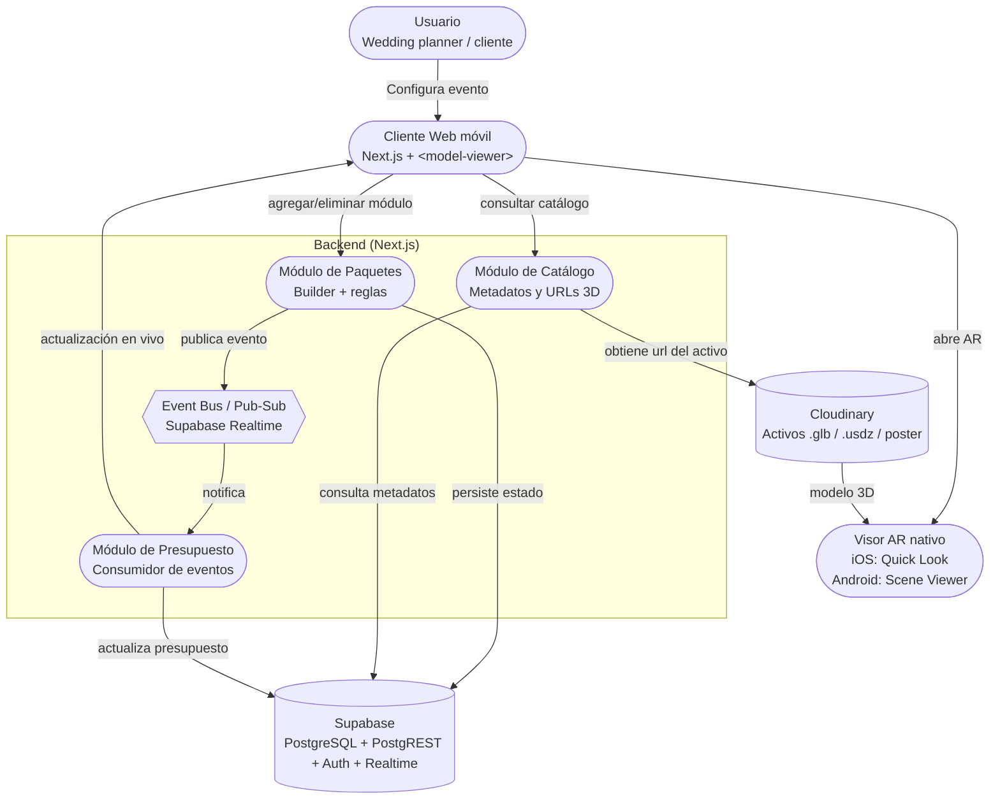
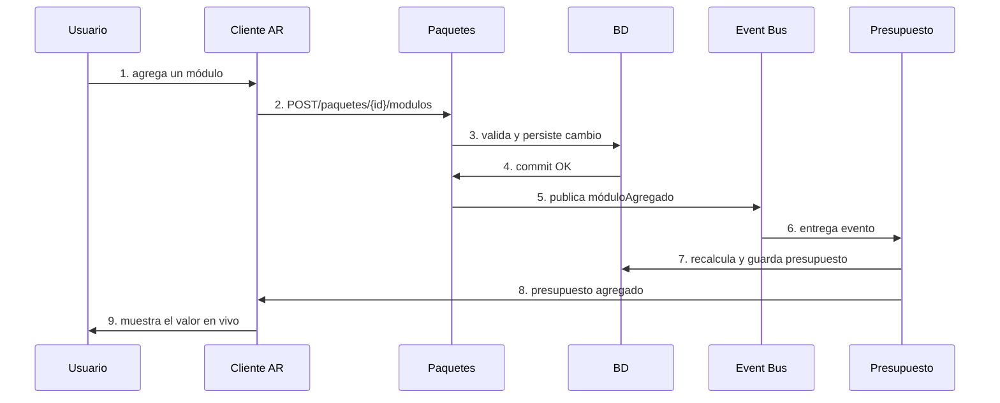
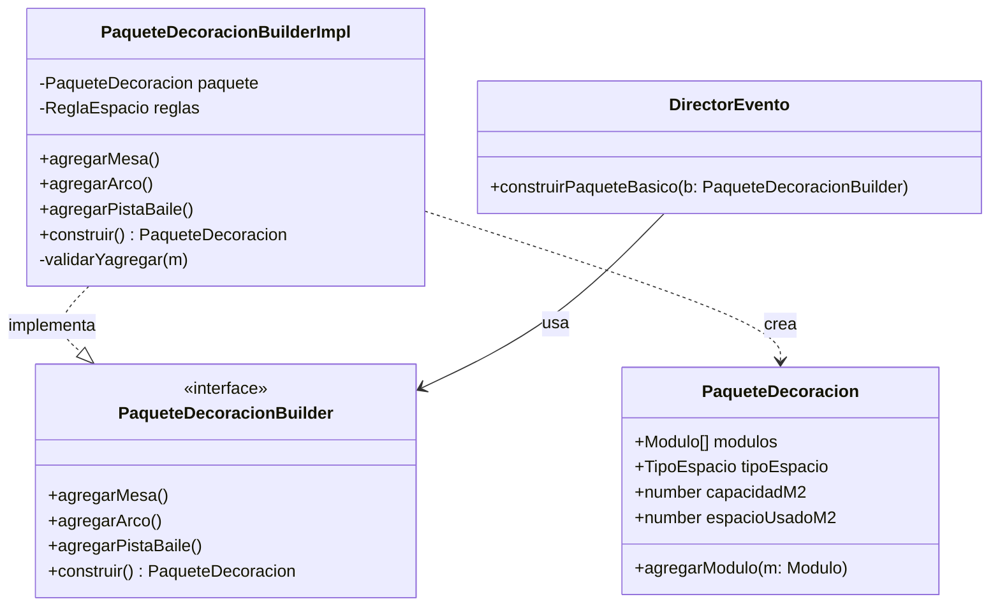
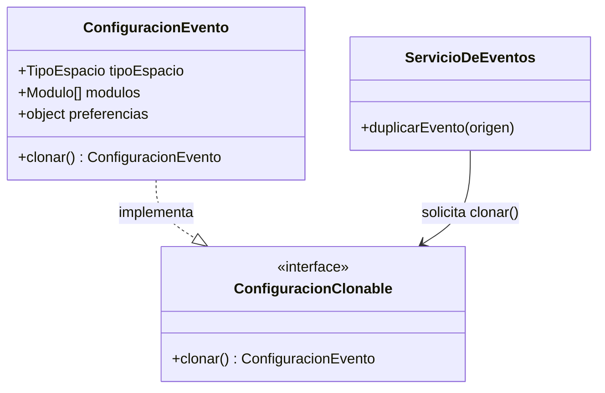

# DecorAR: Arquitectura y diseño

*Mei Ching – Jose Mestre – Rafael Potes – Luis Silva*

## 1. Contexto del proyecto

DecorAR es una herramienta de realidad aumentada dirigida hacia la planificación visual del adorno de eventos sociales, como celebraciones corporativas, fiestas y matrimonios. El propósito es mitigar la incertidumbre previa a la contratación de una decoración: el usuario tiene la capacidad de seleccionar módulos del catálogo, elaborar un paquete y visualizar los elementos 3D a escala 1:1 en el espacio real a través del dispositivo móvil. En iOS, la experiencia puede abrir AR Quick Look; en Android, Scene Viewer; `<model-viewer>` como capa de integración es compatible con el cliente web.

### 1.1 Problema central del MVP

El presupuesto debe reaccionar de forma casi inmediata a cada cambio del paquete sin acoplar la lógica de selección de módulos a la lógica de cálculo de precios. Ese problema justifica el estilo orientado a eventos y el uso de Publish-Subscribe / Event Bus.

### 1.2 Actores y flujo funcional principal

- Usuario (wedding planner o cliente final): define el espacio, selecciona módulos y consulta el presupuesto.
- Cliente AR web móvil: presenta catálogo, configuración y experiencia 3D/AR.
- Backend DecorAR: valida reglas del paquete, persiste cambios, publica eventos y recalcula el presupuesto.
- Servicios externos: almacenamiento de activos 3D y visores AR nativos del dispositivo.

### 1.3 Alcance de la experiencia AR del MVP

La experiencia AR del MVP detecta una superficie horizontal o vertical compatible y permite al usuario colocar, mover y rotar un elemento decorativo 3D a escala 1:1. El cliente utiliza `<model-viewer>` para abrir WebXR o Scene Viewer en Android y Quick Look en iOS. La escala del modelo debe permanecer fija para representar sus dimensiones reales.

El MVP no escanea una habitación completa, no calcula automáticamente su área disponible, no reconoce todos los muebles u obstáculos y no distribuye automáticamente varios elementos evitando colisiones. Estas capacidades requerirían tecnologías de escaneo espacial dependientes del dispositivo, como ARKit RoomPlan, LiDAR o ARCore Depth, y quedan fuera del alcance de esta entrega.

La validación de capacidad realizada por Builder es independiente de la detección de superficies AR. Los valores de capacidad utilizados en los ejemplos de la sección 4.1 son datos demostrativos para probar el patrón, no capacidades oficiales asociadas a una casa, un salón social o un espacio al aire libre. Cuando se necesite demostrar esta regla, la capacidad se proporciona como dato configurable del paquete.

### 1.4 Decisiones funcionales del MVP

- Capacidad del espacio: el usuario ingresa manualmente los metros cuadrados disponibles al crear el paquete. El valor debe ser positivo y finito. El paquete conserva este valor como referencia para que cambios posteriores no alteren silenciosamente una configuración existente.
- Preferencias clonables: una configuración conserva `estilo`, `colores` y `notas`. Prototype realiza una copia profunda de estos datos y de las colecciones mutables.
- Composite: se permiten hasta tres niveles de grupos y se rechazan ciclos. La demostración mínima usa el grupo "Zona de bienvenida", compuesto por un arco floral y una mesa redonda existentes en el catálogo.
- Autenticación: Supabase Auth con correo electrónico y contraseña. Las pruebas de RLS utilizan al menos dos usuarios para demostrar aislamiento.
- Compatibilidad iOS: los tres módulos iniciales deben disponer de USDZ. Cada activo publica GLB, USDZ y poster en Cloudinary.
- Recuperación de eventos: se realizan como máximo tres reintentos, después de 1, 2 y 4 segundos. Tras agotarlos, el evento permanece pendiente para reconciliación desde PostgreSQL.
- Propiedad del presupuesto: Paquetes persiste elementos y área utilizada y publica eventos. Presupuesto consume los eventos, relee el paquete, calcula y persiste el total confirmado y notifica al cliente.
- Nombres canónicos: `agregarArco`, `PaqueteDecoracionBuilderImpl` y `construirPaqueteBasico`.

### 1.5 Decisiones técnicas del MVP

- Usar la versión estable vigente de Next.js al inicializar el repositorio, con App Router y TypeScript estricto.
- Usar Vitest para pruebas unitarias, de componentes y de integración que no requieran navegador completo.
- Usar Playwright para un flujo integral móvil representativo.
- Guardar valores monetarios en COP como enteros.
- Limitar cada GLB o USDZ a 15 MB, con objetivo de optimización inferior a 10 MB. Limitar posters a 1 MB, con objetivo inferior a 300 KB.
- Usar `ar-scale="fixed"` para conservar escala 1:1.
- Publicar activos Cloudinary con identificadores y versiones inmutables. Un reemplazo crea una nueva versión y se activa en el catálogo sólo después de validarse.
- Empaquetar únicamente la aplicación Next.js en Docker. La imagen de producción usa un build multi-stage, salida standalone de Next.js y un usuario no root. `docker compose` levanta únicamente DecorAR; PostgreSQL, PostgREST, Auth y Realtime se consumen desde el proyecto alojado de Supabase, y Cloudinary permanece externo. El MVP no requiere instalar Supabase CLI, PostgreSQL ni una instancia local de Supabase en los equipos del grupo.

### 1.6 Trazabilidad de decisiones:

| Problema del proyecto | Estilo | Problema derivado | Patrón arquitectónico | Problema de código | GoF |
|---|---|---|---|---|---|
| El presupuesto cambia con cada módulo | Orientado a eventos | Propagar cambios sin llamadas directas | Publish-Subscribe / Event Bus | Construir un paquete válido | Builder |
| Reutilizar configuraciones de eventos similares | Orientado a eventos | La copia debe integrarse al mismo flujo de cambios | Publish-Subscribe / Event Bus | Duplicar configuración sin reconstruirla paso a paso | Prototype |
| Un paquete contiene elementos simples y grupos | Orientado a eventos | Los cambios deben representar agregados de forma uniforme | Publish-Subscribe / Event Bus | Calcular precio/espacio igual para simples y compuestos | Composite |
| La visualización AR cambia según plataforma | Orientado a eventos | El cliente consumidor debe evolucionar sin afectar productores | Publish-Subscribe / Event Bus | Separar elemento decorativo del motor de render AR | Bridge |
| Una escena repite muchas instancias del mismo 3D | Orientado a eventos | Los eventos agregan instancias, no copias pesadas del activo | Publish-Subscribe / Event Bus | Compartir geometría y separar posición/rotación | Flyweight |

## 2. Análisis del estilo arquitectónico

### 2.1 Componentes o dominios relevantes

| Componente | Responsabilidad principal | Evento / interacción relevante |
|---|---|---|
| Paquetes | Construcción incremental del paquete y validación de reglas de espacio. | Publica ModuloAgregado / ModuloEliminado. |
| Presupuesto | Recalcular total y exponer el último valor confirmado. | Consume cambios del paquete. |
| Catálogo | Metadatos de módulos, dimensiones, precio y URL del activo 3D. | Consulta síncrona; no necesita conocer Presupuesto. |
| Event Bus | Distribuir eventos del dominio a consumidores interesados. | Desacopla productor y consumidores. |

### 2.2 Estilo apropiado y su límite en el MVP

El presupuesto en vivo es un requerimiento que responde a cambios de estado, por lo cual se integra bien con una arquitectura enfocada en eventos. El productor tiene la capacidad de anunciar que hubo un cambio sin tener conocimiento de cuál será la reacción de los consumidores. Esto hace más sencillo agregar sugerencias, análisis o notificaciones en el futuro sin tener que cambiar la lógica de los paquetes.

**Decisión de alcance para el MVP:** Los componentes previos son considerados módulos lógicos en lugar de microservicios distribuidos de manera independiente. Mantener únicamente una implementación de backend disminuye la complejidad operativa del semestre, pero mantiene límites definidos y comunicación basada en eventos que agrega valor. Algunos módulos podrían desconectarse sin que el contrato de eventos sea redefinido si el producto crece.

### 2.2.1 Acceso a datos con PostgreSQL y PostgREST

Supabase proporciona PostgreSQL como base de datos y PostgREST como su Data API automática. PostgREST no es un componente adicional que el equipo deba desplegar en Docker. Los adaptadores de infraestructura ejecutados en el servidor Next.js pueden usar `supabase-js`, que consume esta Data API.

El navegador utiliza Supabase únicamente para autenticación y suscripción a canales privados de Realtime. La creación o modificación de paquetes, elementos, presupuestos y eventos se realiza mediante Route Handlers de Next.js, los cuales validan la sesión, invocan casos de uso y delegan la persistencia a adaptadores server-side. Los componentes cliente no realizan CRUD directo con `.from()` sobre estas tablas.

Las credenciales elevadas de Supabase se conservan exclusivamente en el servidor y nunca usan el prefijo `NEXT_PUBLIC_`. RLS constituye una defensa adicional en PostgreSQL y no reemplaza la autorización de los Route Handlers.

Las operaciones que deben modificar varias tablas de forma atómica, como actualizar un paquete y registrar su evento outbox, clonar una configuración completa o guardar un presupuesto junto con el `eventId` procesado, se implementan mediante funciones PostgreSQL invocadas desde el servidor con `supabase.rpc()`. Estas funciones usan `SECURITY INVOKER` por defecto, `search_path` vacío y nombres de objetos completamente calificados. `SECURITY DEFINER` sólo se permite cuando sea imprescindible y debe justificarse, restringir permisos y probarse.

El cliente recibe actualizaciones del presupuesto mediante Broadcast privado de Supabase Realtime. No se exponen directamente cambios de las tablas internas mediante `postgres_changes`.

### 2.3 Diagrama de contenedores



### 2.4 Consecuencias, Riesgos y mitigaciones

La arquitectura sugerida tiene varios elementos relevantes a tener en cuenta. Respecto al desacoplamiento, el presupuesto no está sujeto a llamadas directas desde Paquetes; por ende, se sugiere emplear contratos de eventos versionados y pruebas de integración.

En cuanto a la escalabilidad, los clientes tienen la capacidad de expandirse de manera autónoma, dividiendo procesos únicamente cuando haya una necesidad real de carga.

En lo que respecta a la consistencia eventual, puede haber un pequeño retraso entre la actualización del paquete y el presupuesto. Para disminuir este retraso, se puede mostrar un estado de "actualizando...", conservar la base de datos como fuente de verdad y posibilitar la resincronización.

La observabilidad también es un desafío, dado que los flujos asíncronos son más complicados de depurar. Por eso se aconseja el uso de eventId/correlationId, registros estructurados y métricas sobre fallos y reintentos.

Para prevenir que se repita o se pierda la entrega, es importante tener en cuenta que un canal de tiempo real no siempre actúa como una cola durable. Por ello, los consumidores tienen que ser idempotentes, almacenar los datos antes y disponer de procedimientos para volver a intentar y conciliar desde la base de datos.

Por último, respecto a la seguridad, si los canales en tiempo real se configuran de manera incorrecta pueden revelar información. Por eso es necesario establecer políticas de RLS por usuario o evento, canales privados y mecanismos de autenticación.

## 3. Patrón arquitectónico: Publish-Subscribe / Event Bus

### 3.1. Problema que resuelve

El Servicio/Módulo de Paquetes produce cambios del dominio, mientras que Presupuesto y futuros consumidores necesitan reaccionar. Si Paquetes invocara directamente a cada interesado, aumentaría el acoplamiento y cada nuevo consumidor obligaría a modificar código ya estable. Publish-Subscribe introduce un intermediario: el productor publica un evento y desconoce quién lo procesa.

### 3.2. Participantes y responsabilidades

- Productor - Paquetes: valida, persiste el cambio y publica un evento del dominio.
- Event Bus: enruta el evento a los suscriptores del tópico correspondiente.
- Consumidor - Presupuesto: procesa el evento, recalcula y persiste el nuevo total.
- Cliente AR: recibe el valor actualizado por canal realtime o lo consulta nuevamente desde la API.

### 3.3. Diagrama de secuencia



### 3.4. Decisiones de fallo y recuperación

- Persistencia primero: el paquete debe quedar confirmado en la base de datos antes de emitir el evento. Así, la base de datos permanece como fuente de verdad incluso si falla el canal realtime.
- Reintento controlado: si la publicación o el consumo falla transitoriamente, se reintenta con un número limitado de intentos y registro del error.
- Idempotencia: cada evento lleva eventId. Presupuesto registra los eventId procesados o valida una versión del agregado para no sumar dos veces el mismo cambio.
- Resincronización: si el cliente pierde una actualización realtime, vuelve a consultar el presupuesto persistido. Para un entorno productivo con exigencias mayores, se recomienda un broker o cola durable.

### 3.5. ¿Qué pasaría sin Publisher-Suscribe?

Paquetes debería contactar directamente a Presupuesto tras cada operación para conocer cualquier nuevo cliente futuro. Si el consumidor falla, es posible que se detenga o degrade el flujo de selección; si se añaden notificaciones o analíticas, sería necesario cambiar los paquetes. El resultado sería un acoplamiento más alto, menos extensibilidad y pruebas más complejas.

Supabase Realtime puede funcionar como un sistema de baja latencia para el MVP, sin embargo, el diseño no debe suponer que un canal en tiempo real sustituye por sí mismo las garantías de una cola durable. Por esta razón, se sugiere la idempotencia, la persistencia anterior y la reconciliación.

## 4. Patrones de diseño GoF aplicados

DecorAR propone varios patrones de diseño para abordar diversas necesidades:

El patrón Builder, un patrón de creación, permite la construcción paso a paso de paquetes y la validación de reglas antes de generar el producto final; por consiguiente, es el patrón principal implementado.

El patrón Prototype, también de creación, permite duplicar configuraciones similares sin necesidad de reconstruirlas módulo a módulo. Para esta entrega se implementa en código y se evidencia mediante la clonación profunda de una configuración.

Por su parte, el patrón Composite, un patrón estructural, permite tratar de la misma manera tanto los elementos decorativos individuales como los conjuntos decorativos, lo que lo convierte en un patrón complementario.

El patrón Bridge, también estructural, desacopla el elemento decorativo de la plataforma de renderizado de realidad aumentada, mientras que el patrón Flyweight, igualmente estructural, permite reutilizar el mismo activo 3D en múltiples instancias dentro de la escena. Estos tres últimos patrones se consideran complementarios dentro de la arquitectura propuesta.

### 4.1. Builder: patrón principal implementado

El propósito del patrón Builder es distinguir entre la construcción incremental de PaqueteDecoracion y su representación final, lo que posibilita que cada adición sea validada. El problema que soluciona es el de evitar constructores con numerosos parámetros opcionales o setters desparramados, ya que estos podrían producir estados intermedios inválidos y redundar las normas de capacidad. Los participantes más importantes son PaqueteDecoracion, PaqueteDecoracionBuilderImpl, DirectorEvento y PaqueteDecoracionBuilder. Por lo tanto, se optimiza la legibilidad, se simplifica el encadenamiento de operaciones y se centralizan las validaciones; sin embargo, se agrega una capa de indirección que es necesaria a causa de las reglas y variaciones del objeto.



En las siguientes imágenes se muestra la funcionalidad del Builder gracias al diagrama de clases:

```javascript
class PaqueteDecoracionBuilderImpl extends PaqueteDecoracionBuilder {
  constructor(tipoEspacio, capacidadM2) {
    super();
    if (!REGLAS_ESPACIO[tipoEspacio]) {
      throw new Error(`Tipo de espacio no soportado: ${tipoEspacio}`);
    }
    this.paquete = new PaqueteDecoracion(tipoEspacio);
    this.reglas = { capacidadM2 };
  }

  _validarYAgregar(modulo) {
    const espacioFinal = this.paquete.espacioUsadoM2 + modulo.ocupaM2;
    if (espacioFinal > this.reglas.capacidadM2) {
      console.log(
        `ERROR: No se agregó "${modulo.nombre}": excede la capacidad del espacio ` +
        `(${espacioFinal}/${this.reglas.capacidadM2} m²).`
      );
      return this;
    }
    this.paquete.agregarModulo(modulo);
    return this;
  }

  agregarMesa() { return this._validarYAgregar(CATALOGO.mesaRedonda); }
  agregarArco() { return this._validarYAgregar(CATALOGO.arcoFloral); }
  agregarPistaBaile() { return this._validarYAgregar(CATALOGO.pistaBaile); }

  construir() {
    // Devuelve una copia para evitar que el cliente modifique el estado interno del builder.
    return {
      tipoEspacio: this.paquete.tipoEspacio,
      modulos: this.paquete.modulos.map((m) => ({ ...m })),
      espacioUsadoM2: this.paquete.espacioUsadoM2,
    };
  }
}
```

Y lo corremos en la terminal:

```text
DecorAR — prueba patrón Builder

PRUEBA 1: Paquete armado paso a paso para un salón social:
{
  tipoEspacio: 'salonSocial',
  modulos: [
    {
      id: 'mesa-redonda',
      nombre: 'Mesa redonda x10',
      precio: 250000,
      ocupaM2: 4
    },
    {
      id: 'mesa-redonda',
      nombre: 'Mesa redonda x10',
      precio: 250000,
      ocupaM2: 4
    },
    {
      id: 'arco-floral',
      nombre: 'Arco floral de entrada',
      precio: 200000,
      ocupaM2: 2
    },
    {
      id: 'pista-baile-4x4',
      nombre: 'Pista de baile 4x4',
      precio: 600000,
      ocupaM2: 16
    }
  ],
  presupuestoTotal: 1300000,
  espacioUsadoM2: 26
}
```

```text
PRUEBA 3: Validación de regla de espacio: se intenta agregar DOS pistas de baile a una casa (30 m²):
  ERROR: No se agregó "Pista de baile 4x4": excede la capacidad del espacio (32/30 m²).
{
  tipoEspacio: 'casa',
  modulos: [
    {
      id: 'pista-baile-4x4',
      nombre: 'Pista de baile 4x4',
      precio: 600000,
      ocupaM2: 16
    },
    {
      id: 'arco-floral',
      nombre: 'Arco floral de entrada',
      precio: 200000,
      ocupaM2: 2
    }
  ],
  presupuestoTotal: 800000,
  espacioUsadoM2: 18
}
```

```text
PRUEBA 2: Paquete básico armado por el Director (reutilizable) para aire libre:
{
  tipoEspacio: 'aireLibre',
  modulos: [
    {
      id: 'arco-floral',
      nombre: 'Arco floral de entrada',
      precio: 200000,
      ocupaM2: 2
    },
    {
      id: 'mesa-redonda',
      nombre: 'Mesa redonda x10',
      precio: 250000,
      ocupaM2: 4
    },
    {
      id: 'mesa-redonda',
      nombre: 'Mesa redonda x10',
      precio: 250000,
      ocupaM2: 4
    }
  ],
  presupuestoTotal: 700000,
  espacioUsadoM2: 10
}
```

### 4.2. Prototype: segundo patrón modelado

**Propósito:** Conservar una base que puede ser alterada después y crear una ConfiguracionEvento a partir de otra configuración válida.

**Problema de código:** Los wedding planners tienen la posibilidad de repetir paquetes, estilos o salones; rehacer cada acontecimiento desde el principio incrementa los errores y malgasta trabajo.

**Participantes:** ConfiguracionClonable, ConfiguracionEvento y ServicioDeEventos.

**Resultados:** Disminuye el costo de generar variantes; exige tomar decisiones sobre qué datos se copian en profundidad. Los activos 3D que no cambian pueden ser compartidos, pero las preferencias y las listas mutables deben ser duplicadas para prevenir efectos cruzados.



### 4.3. Composite: paquetes y módulos jerárquicos

**Intención:** Componer objetos en estructuras de árbol y tratar de forma uniforme elementos simples y grupos.

**Problema de código:** Una “Zona de bienvenida” puede contener un arco floral y una mesa redonda. Sin Composite, el cálculo de precio, área y listado tendría condicionales distintos para cada nivel.

**Participantes:** ComponenteDecorativo (interfaz), ElementoDecorativo (hoja) y GrupoDecorativo/ModuloCompuesto (composite).

**Consecuencias:** Simplifica recorridos y cálculos recursivos; facilita crear paquetes anidados. La implementación rechaza ciclos y limita los grupos a tres niveles.

### 4.4. Bridge: desacoplar decoración y render AR

**Intención:** Separar la abstracción del elemento decorativo de la implementación de renderizado para que ambas jerarquías evolucionen de manera independiente.

**Problema de código:** Los mismos objetos deben mostrarse en iOS y Android, pero los mecanismos nativos y formatos preferidos no son idénticos.

**Participantes:** ElementoAR (abstracción), MesaAR/ArcoAR (abstracciones refinadas), RenderizadorAR (implementador), RenderizadorQuickLook y RenderizadorSceneViewer (implementaciones concretas).

**Consecuencias:** Evita duplicar clases por combinación “tipo de elemento x plataforma”; permite añadir WebXR u otro visor sin modificar el modelo de decoración. Añade una interfaz adicional que debe mantenerse simple.

### 4.5. Flyweight: reutilización de activos 3D

**Intención:** Compartir estado intrínseco costoso entre muchas instancias y mantener el estado extrínseco fuera del objeto compartido.

**Problema de código:** Varias instancias de una misma mesa no deben implicar varias copias del mismo archivo 3D en memoria ni descargas idénticas.

**Participantes:** Activo3DCompartido (flyweight), FabricaActivos3D (cache por assetId/URL) e InstanciaDecorativa (posición, rotación, escala, color permitido).

**Consecuencias:** Reduce memoria, descargas y tiempo de carga; exige que el activo compartido sea inmutable y que transformaciones por instancia permanezcan separadas.

## 5. Conclusiones

La arquitectura Publish-Subscribe y la orientada a eventos posibilitan que el presupuesto se actualice sin que los componentes tengan un acoplamiento directo, con el canal en tiempo real como medio de difusión y la base de datos como fuente principal de información. En términos de código, Builder simplifica la creación de paquetes, Prototype permite que las configuraciones se reutilicen, Composite gestiona conjuntos decorativos, Bridge distingue las variaciones entre plataformas AR y Flyweight mejora la utilización de activos 3D que se repiten.

Como restricciones del MVP, no se tiene previsto desarrollar microservicios independientes en el semestre. Asimismo, el sistema en tiempo real otorga prioridad a la latencia baja, aunque la precisión de AR también depende del aparato y de los activos 3D. Al final, Prototype y Flyweight tendrán que ser sometidos a pruebas de validación para prevenir inconvenientes con estados compartidos.
