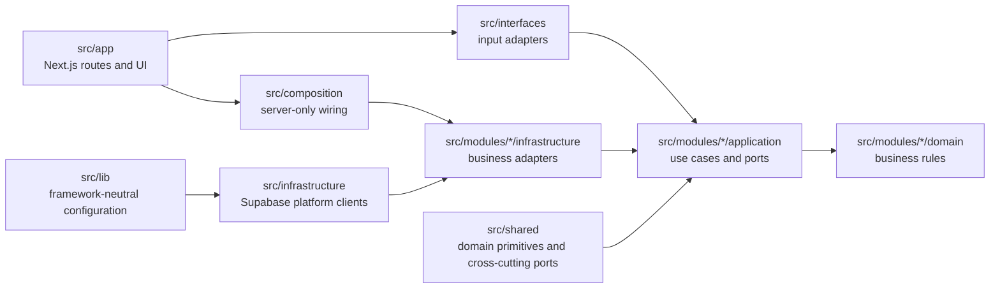

# Arquitectura del código

DecorAR es un monolito modular Next.js. Los módulos se despliegan juntos, pero sus dependencias respetan Clean Architecture.

## Ubicaciones

| Ruta | Responsabilidad |
|---|---|
| `src/app` | Páginas y Route Handlers exigidos por App Router. Los handlers adaptan HTTP; no implementan dominio ni persistencia. |
| `src/interfaces` | Controladores y adaptadores de entrada reutilizables invocados por Route Handlers. |
| `src/modules/*/domain` | Entidades y reglas sin React, Next.js, Supabase, Cloudinary ni capas externas. |
| `src/modules/*/application` | Casos de uso y puertos. Puede importar dominio; no adaptadores concretos. |
| `src/modules/*/infrastructure` | Implementaciones de puertos para persistencia, eventos o proveedores. |
| `src/infrastructure` | Clientes compartidos de plataforma. No contiene reglas de negocio. |
| `src/composition` | Construcción server-only de dependencias concretas. |
| `src/shared` | Primitivas de dominio y contratos transversales mínimos. |
| `src/lib` | Configuración neutral existente; no es una capa de negocio. |

## Reglas verificadas

| Regla | Permitido | Prohibido |
|---|---|---|
| `domain-external-framework` | TypeScript y dominio compartido | React, Next.js, Supabase, Cloudinary |
| `domain-internal-dependency` | Dominio del mismo módulo y `src/shared/domain` | Aplicación, infraestructura, interfaces, composition root |
| `application-internal-dependency` | Dominio y puertos | Infraestructura, interfaces, composition root |
| `interfaces-infrastructure-dependency` | Aplicación y dominio | Adaptadores concretos de infraestructura |
| `app-infrastructure-dependency` | Interfaces y composition root | Adaptadores concretos de infraestructura desde entradas server-side |
| `client-server-import` | UI y cliente Supabase browser | Adaptadores server/admin, `server-only`, composition root |
| `client-business-crud` | Auth y Realtime privados | `.from()` sobre catálogo, paquetes, elementos, presupuestos o eventos |
| `packages-budget-coupling` | Eventos o puertos compartidos | Import directo desde packages hacia budget |

`scripts/scan-architecture.test.ts` valida el árbol real y casos negativos controlados. PostgREST es la Data API interna de Supabase, no un módulo ni despliegue separado.
