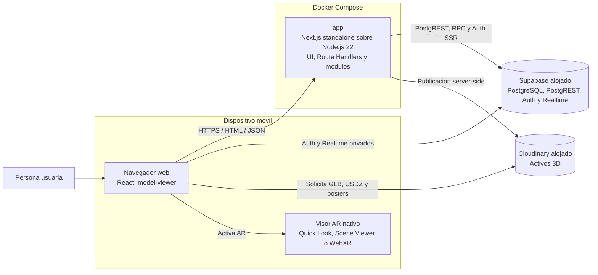

# C4 nivel 2: contenedores

```mermaid
flowchart LR
    user["Persona usuaria"]
    subgraph device["Dispositivo movil"]
        browser["Navegador web<br/>React, model-viewer"]
        viewer["Visor AR nativo<br/>Quick Look, Scene Viewer o WebXR"]
    end

    subgraph host["Docker Compose"]
        app["app<br/>Next.js standalone sobre Node.js 22<br/>UI, Route Handlers y modulos"]
    end

    supabase[("Supabase alojado<br/>PostgreSQL, PostgREST, Auth y Realtime")]
    cloudinary[("Cloudinary alojado<br/>Activos 3D")]

    user --> browser
    browser -->|"HTTPS / HTML / JSON"| app
    browser -->|"Auth y Realtime privados"| supabase
    app -->|"PostgREST, RPC y Auth SSR"| supabase
    app -->|"Publicacion server-side"| cloudinary
    browser -->|"Solicita GLB, USDZ y posters"| cloudinary
    browser -->|"Activa AR"| viewer
```

`compose.yaml` define un unico servicio: `app`. Supabase y Cloudinary no forman parte de Compose ni requieren instalacion local.
