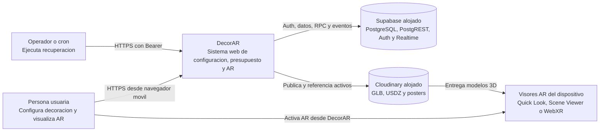

# C4 nivel 1: contexto

```mermaid
flowchart LR
    user["Persona usuaria<br/>Configura decoracion y visualiza AR"]
    operator["Operador o cron<br/>Ejecuta recuperacion"]
    decorar["DecorAR<br/>Sistema web de configuracion, presupuesto y AR"]
    supabase[("Supabase alojado<br/>PostgreSQL, PostgREST, Auth y Realtime")]
    cloudinary[("Cloudinary alojado<br/>GLB, USDZ y posters")]
    viewers["Visores AR del dispositivo<br/>Quick Look, Scene Viewer o WebXR"]

    user -->|"HTTPS desde navegador movil"| decorar
    operator -->|"HTTPS con Bearer"| decorar
    decorar -->|"Auth, datos, RPC y eventos"| supabase
    decorar -->|"Publica y referencia activos"| cloudinary
    user -->|"Activa AR desde DecorAR"| viewers
    cloudinary -->|"Entrega modelos 3D"| viewers
```

DecorAR es el sistema bajo estudio. Supabase, Cloudinary y los visores nativos son sistemas externos.
